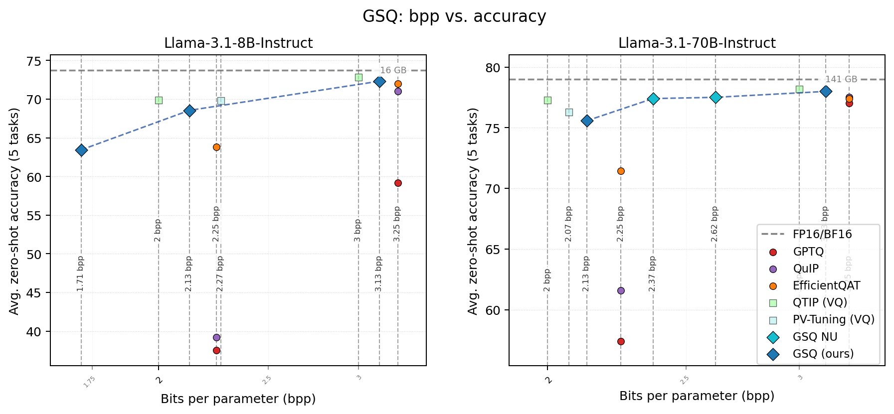
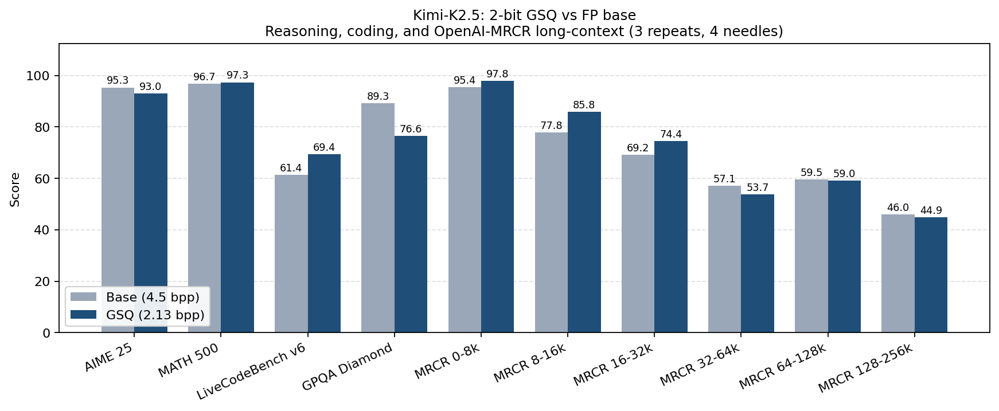
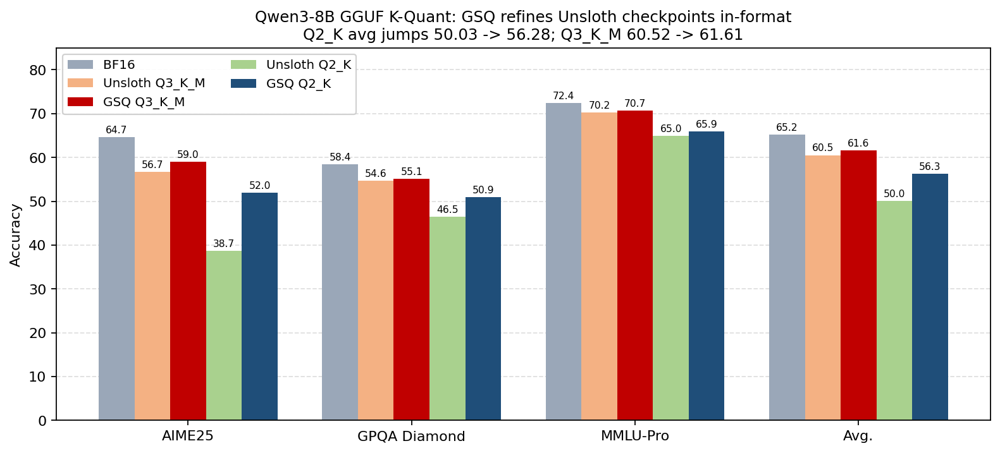

# GSQ: Gumbel-Softmax Quantization for LLMs

[](https://arxiv.org/abs/2604.18556)
[](https://huggingface.co/papers/2604.18556)
[](https://hf.co/collections/ISTA-DASLab/gsq)

**Paper:** *GSQ: Highly-Accurate Low-Precision Scalar Quantization for LLMs via Gumbel-Softmax Sampling* (preprint)
**Authors:** Alireza Dadgarnia, Soroush Tabesh, Mahdi Nikdan, Michael Helcig, Eldar Kurtić, Max Kleinegger, Dan Alistarh — ISTA / ETH Zürich / TU Wien / Red Hat AI

---

## TL;DR

GSQ is a **post-training scalar quantization** method that learns per-coordinate grid assignments and per-group scales using a Gumbel-Softmax relaxation of the discrete grid. It closes most of the accuracy gap between simple scalar PTQ (GPTQ, QuIP, EfficientQAT) and second-wave vector / trellis methods (QTIP, AQLM, PV-Tuning) at 2–3 bits per parameter, while keeping a **symmetric, group-wise scalar format** that is directly compatible with existing INT inference kernels and with GGUF K-Quant deployment stacks. The same discrete-assignment optimization scales from dense Llama-3.1-8B/70B all the way to trillion-parameter MoE models such as Kimi-K2.5 and Qwen3.5-MoE, and can also refine publicly released GGUF K-Quant checkpoints in-format.

---

## Headline Results

GSQ pushes the size-vs-accuracy Pareto frontier across model scales and bit widths, matching or beating prior scalar PTQ methods at the same footprint and closing most of the gap to vector-quantized baselines.



### Kimi-K2.5: 2-bit GSQ vs FP base

GSQ compresses Kimi-K2.5 from ~4.5 bpp down to **2.13 bpp** while preserving most of the model's reasoning, coding, and long-context behaviour. It even beats the base model on MATH 500 and LiveCodeBench v6 under our evaluation pipeline, and stays competitive on OpenAI-MRCR up to 256k tokens.



### Qwen3-8B GGUF K-Quant

Starting from public Unsloth GGUF checkpoints, GSQ refines the discrete assignments and projects the result back into the **same K-Quant format**, so the optimized checkpoint runs unchanged on llama.cpp / Ollama. The gains are largest in the aggressive Q2_K setting (avg score 50.03 → **56.28**).



### Llama-3.1-Instruct, 2.13 bpp (zero-shot avg over ARC-C/E, HellaSwag, PIQA, Winogrande)

GSQ is the strongest **scalar** PTQ method we measured, and lands within ~1.7 points of the QTIP / PV-Tuning vector-quantized frontier at 70B.

| Method          |   8B Avg  |  70B Avg  |
|-----------------|:---------:|:---------:|
| FP16            | 73.71     | 78.99     |
| GPTQ            | 37.53     | 57.38     |
| QuIP            | 39.20     | 61.57     |
| EfficientQAT    | 63.79     | 71.43     |
| QTIP (VQ)       | 69.88     | 77.25     |
| PV-Tuning (VQ)  | 69.83     | 76.27     |
| **GSQ (ours)**  | **68.55** | **75.57** |

Plots are produced from paper-table data by `scripts/make_readme_plots.py` — re-run with `python scripts/make_readme_plots.py --out assets/` after editing the literals at the top of that file.

---

## How GSQ Works

GSQ quantizes LLM weights **layer by layer** using a two-stage pipeline:

1. **GPTQ initialization** — for each transformer layer, GPTQ uses second-order Hessian information from calibration activations to produce initial quantized weights and per-group scales. (`init_method: rtn` is also supported as an ablation.)
2. **Gumbel-Softmax refinement** — logits over discrete weight values (signs, sparsity masks, or integer levels) are trained with a differentiable Gumbel-Softmax relaxation. Temperature and logit scale are annealed over epochs so the soft distribution sharpens toward a hard discrete choice.
3. **Layer offloading** — each completed layer is saved as compressed `.safetensors` shards and offloaded to a `meta` device, so models much larger than GPU VRAM can be quantized.
4. **Model reassembly** — `save_model.py` merges the per-layer shards into a complete HuggingFace-compatible checkpoint with a `compressed-tensors` quantization config for vLLM auto-detection.

### Mechanism in detail

For each linear layer $f(x; w)$, GSQ minimizes the layer-wise reconstruction error

$$
\hat{w} = \arg\min_{\tilde{w}} \lVert f(x;\tilde{w}) - f(x;w) \rVert_F^2
\quad \text{s.t.} \quad \tilde{w} \in \mathcal{C},
$$

where the constraint set $\mathcal{C}$ encodes the target quantization grid (e.g. ternary $\lbrace -s, 0, s \rbrace^d$, 2-bit $\lbrace -2, -1, 0, 1 \rbrace \cdot s$, or a general $b$-bit symmetric grid). Each weight slot gets its own learnable logit vector over the small grid $\mathcal{D}$ (size 2 for ternary mask/sign, 4 for 2-bit, ...). At each step a **Gumbel-Softmax sample** turns those logits into a soft one-hot vector — the temperature $\tau$ is annealed *high → low* so gradients flow through several candidates early and collapse onto a single grid value at the end, while the logit scale $\kappa$ is annealed *low → high* to sharpen the distribution. The binary case uses a single logit $\ell$ and treats $-\ell$ as the other class, which halves the parameter count and is why each bit-width has its own quantizer module (`src/quantization/gumbel_quantizer_{1bit,2bit,ternary}.py`). Optimization runs in bf16 (or fp32, see `quantization.logits_dtype`) using the **Lion** optimizer with a cosine LR schedule on top of the GPTQ-initialized scales. The custom autograd op replays the RNG state in the backward pass to compute exact gradients through the Gumbel sample. After training, logits are hard-rounded and the resulting integer grid + scales are serialized — staying in the symmetric scalar format means the result drops into existing INT kernels and into GGUF K-Quant deployment stacks without changes.

### Supported quantization schemes

The GSQ precision is controlled by the `quantization.gsq_bits` config key:

| `gsq_bits`    | Quantizer Class          | Bits/weight | Codebook                     | Description                                          |
|---|---|---|---|---|
| `2` (default) | `GumbelQuantizer2Bit`    | 2-bit       | `{-2, -1, 0, 1}` × scale     | 4-level integer with learned per-group scale         |
| `> 2`         | `GumbelQuantizerInt`     | n-bit       | `(init + {-2, -1, 0, 1, -2})` × scale     | 5-level integer with learned per-group scale         |
| `"ternary"`   | `GumbelQuantizerTernary` | ~1.58-bit   | `{-1, 0, +1}` × scale        | Separate sign and mask logits with learned scale     |

---

## Supported Models

| Model Family          | Wrapper                                                | Notes                                                                  |
|---|---|---|
| Meta LLaMA            | `LLaMAWrapper`                                         | Dense                                                                  |
| Qwen3            | `Qwen3Wrapper`                                         | Dense                                                                  |
| Qwen3-MoE             | `Qwen3MoeWrapper` / `Qwen3MoeDistributedWrapper`       | MoE, expert-parallel, 128 experts (Qwen3-235B-A22B and Qwen3-30B-A3B)  |
| Qwen3.5/3.6            | `Qwen35Wrapper`                                         | Dense                                                                  |
| Qwen3.5/3.6-MoE           | `Qwen35MoeWrapper` / `Qwen35MoeDistributedWrapper`     | MoE, hybrid attention, shared experts (35B-A3B / 122B-A10B / 397B-A17B)|
| Gemma-4-35B            | `Gemma4Wrapper`                                         | Dense                                                                  |
| Kimi K2 / K2.5        | `KimiK2Wrapper` / `KimiK2DistributedWrapper`           | MoE, expert-parallel; K2.5 has 384 experts (~260 GB)                    |

**Qwen3.5-MoE** requires `transformers >= 5.3` (this currently conflicts with Kimi-K2.5; swap as needed per run).

---

## Supported GPU architectures

GSQ has only been **tested on NVIDIA Hopper (H100, sm_90)**. Training itself should work on any reasonably modern CUDA GPU (we've also run training on L40S/Ada), but the **vLLM serving / lm-eval step requires Hopper or Ampere** (sm ≥ 80). On Ada (L40S, sm_89) vLLM has no Marlin kernel for compressed-tensors WNA16 fused MoE and falls back to a Triton path that crashes inside `moe_sum` during `profile_run`. `scripts/serve_model.sh` emits a warning when launched on sm < 80 or sm == 89. See [`research_logs/knowledge/04-hopper-ampere-required-for-serve.md`](research_logs/knowledge/04-hopper-ampere-required-for-serve.md) for the diagnosis. If you need to serve quantized MoE checkpoints on Ada, that is currently a vLLM-upstream gap, not a GSQ one.

**TP for MoE serving.** vLLM requires `num_attention_heads % TP == 0` (and `num_key_value_heads % TP == 0` when GQA). The Marlin WNA16 MoE kernel additionally requires `(moe_intermediate_size / TP) % max(64, group_size) == 0`; otherwise vLLM silently falls back to the same broken Triton path. With the default `groupsize=128`, **effective** max TP on 8 GPUs (Marlin ∩ attention heads):

| Model | `moe_intermediate_size` | `num_attention_heads` | Max valid TP on 8 GPUs |
|---|---|---|---|
| Qwen3-30B-A3B, Qwen3.5-35B-A3B | 768 | 32 | **2** (Marlin allows 6, but 32 % 6 ≠ 0) |
| Qwen3-235B-A22B, Qwen3.5-122B/397B | 1536 | 64 | **4** (Marlin allows 6, but 64 % 6 ≠ 0) |
| Kimi-K2 / K2.5 | 2048 | 64 | **8** |

`scripts/serve_model.sh` auto-clamps `TP_SIZE` to the largest valid value for the assembled checkpoint's `config.json` and logs a warning when it changes the requested TP. Set `TP_SIZE_FORCE=1` to skip the clamp. See [`research_logs/knowledge/05-vllm-tp-marlin-moe-shape-constraint.md`](research_logs/knowledge/05-vllm-tp-marlin-moe-shape-constraint.md).

---

## Installation

GSQ uses **[uv](https://docs.astral.sh/uv/getting-started/installation/)** for environment management. Install it first:

```bash
curl -LsSf https://astral.sh/uv/install.sh | sh
```

Then clone and run the setup script:

```bash
git clone https://github.com/IST-DASLab/GSQ.git
cd GSQ
cp .env.example .env   # optional template; add HF_TOKEN before gated models / WandB
bash scripts/setup_env.sh        # uv sync + flash-attn + import sanity check
```

`scripts/setup_env.sh` runs `uv sync` to create `./.venv` from [`uv.lock`](uv.lock) (PyTorch, vLLM, lm-eval, and the rest of the runtime stack), installs `flash-attn` on top, and verifies that all required packages import. Override defaults with `VENV_PATH=<path>`, `PYTHON_VERSION=3.11`, `SKIP_FLASH_ATTN=1`, or `TORCH_CUDA=cu124` (default is `cu128`, pinned in [`pyproject.toml`](pyproject.toml) under `[[tool.uv.index]]`).

If you prefer to manage the venv by hand:

```bash
uv sync                                                  # locked deps -> ./.venv
uv pip install flash-attn --no-cache-dir --no-build-isolation

# Different CUDA target (e.g. cu124 instead of the default cu128):
UV_INDEX_PYTORCH=https://download.pytorch.org/whl/cu124 uv sync
```

The PyTorch wheel index is pinned via `[[tool.uv.index]]` in `pyproject.toml`; override it with `UV_INDEX_PYTORCH=<url>` (or pass `TORCH_CUDA=cu124` to `setup_env.sh`).

The `scripts/*.sh` helpers activate `./.venv` automatically; `source .venv/bin/activate` is only needed for an interactive shell.

> A HuggingFace account with access to gated models (e.g. Kimi-K2.5) is required for those model families.

GSQ source code lives under [`src/`](src/) (config, trainer, model wrappers, quantizers, MoE ops, GPTQ prior). Training entry point: [`main.py`](main.py); reassembly: [`save_model.py`](save_model.py); evaluation: [`eval_model.py`](eval_model.py). Bare-metal entry scripts (no Slurm, no containers) are in [`scripts/`](scripts/) — see "Run GSQ on Your Model" below.

---

## Run GSQ on Your Model

### Quick start (local, single GPU)

```bash
bash scripts/run.sh                         # default config, all visible GPUs
SMOKE_TEST=1 bash scripts/run.sh            # 2-layer smoke test

# Or invoke main.py directly via uv (no activation needed):
uv run python main.py --config configs/local/config.yaml
uv run python main.py --config configs/local/config.yaml --max-layers 2
```

Each run is assigned a unique ID (e.g. `20260306-143025_a1b2c3`) and checkpoints are stored under `training.checkpoint_dir/<run_id>/`. The run ID is printed at startup and logged to WandB.

### Multi-GPU on one node (dense models)

```bash
NPROC=4 bash scripts/run.sh
# Or directly:
uv run torchrun --standalone --nproc-per-node=4 main.py --config configs/local/config.yaml
```

> **Per-GPU memory scales up with `NPROC` for dense models.** Dense runs are **data-parallel**: every rank builds the full set of quantizers for the resident layer and only the calibration batch is split. Per-GPU memory is therefore roughly the single-GPU working set **plus** NCCL communicator overhead (~0.5-0.7 GB per rank), so `NPROC>1` needs *more* headroom per card than `NPROC=1`, not the same. On tight VRAM prefer `NPROC=1`, bumping `NPROC` will not reduce the per-rank floor. (Sharding the weights themselves would require dense tensor parallelism, which GSQ does not implement.)
>
> **Debugging OOMs — `expandable_segments`.** The scripts default to `PYTORCH_CUDA_ALLOC_CONF=expandable_segments:True` (set in [`scripts/_common.sh`](scripts/_common.sh)) because it reduces fragmentation on the large target models. On some setups this can surface an out-of-memory condition as a misleading `CUDA driver error: device not ready` instead of a clean OOM. If you hit that, re-run with `PYTORCH_CUDA_ALLOC_CONF=expandable_segments:False` to get an actionable `torch.OutOfMemoryError`.

For multi-node MoE runs (Kimi, Qwen-MoE), set the standard PyTorch distributed env vars (`WORLD_SIZE`, `RANK`, `LOCAL_RANK`, `MASTER_ADDR`, `MASTER_PORT`) on each node before invoking `bash scripts/run.sh`; the launcher will detect them and skip its built-in `torchrun`. The wrappers initialize NCCL from those env vars directly.

### Per-model recipes

The bare-metal entry scripts live under [`scripts/`](scripts/) and are wrappers around `main.py` / `save_model.py` / `eval_model.py`. They activate the local venv (`./.venv` by default), load `.env` through [`scripts/_common.sh`](scripts/_common.sh), and launch via `torchrun --standalone --nproc-per-node=$(visible GPUs)`.

| Model                                | Config                                                          | Command                                                                   | Approx GPUs                                              |
|---|---|---|---|
| Llama-3.1-8B-Instruct                | `configs/local/config.yaml` (set `model.name`)                  | `CONFIG_FILE=<cfg> bash scripts/run.sh`                                   | 1× H100/A100 (80 GB)                                     |
| Llama-3.1-70B-Instruct               | `configs/local/config.yaml` (set `model.name`)                  | `CONFIG_FILE=<cfg> bash scripts/run.sh`                                   | 4× H100 (80 GB)                                          |
| Qwen3-30B-A3B (Instruct / Thinking)  | `configs/qwen3/qwen3_30B_A3B_*.yaml`                            | `CONFIG_FILE=<cfg> bash scripts/run.sh`                                   | 4× H200 (single node)                                    |
| Qwen3-235B-A22B (Instruct / Thinking)| `configs/qwen3/qwen3_235B_A22B_*.yaml`                          | `CONFIG_FILE=<cfg> bash scripts/run.sh`                                   | 8× H200 (single node) or multi-node                      |
| Qwen3.5-35B-A3B                      | `configs/qwen35/qwen35_35B_A3B.yaml`                            | `CONFIG_FILE=<cfg> bash scripts/run.sh`                                   | 4× H200                                                  |
| Qwen3.5-122B-A10B                    | `configs/qwen35/qwen35_122B_A10B.yaml`                          | `CONFIG_FILE=<cfg> bash scripts/run.sh`                                   | 8× H200                                                  |
| Qwen3.5-397B-A17B                    | `configs/qwen35/qwen35_397B_A17B.yaml`                          | `CONFIG_FILE=<cfg> bash scripts/run.sh`                                   | 16× H200 (multi-node); needs `transformers >= 5.3`       |
| Kimi-K2 (Instruct / Thinking)        | `configs/kimi-k2/kimi_k2_{instruct,thinking}.yaml`              | `CONFIG_FILE=<cfg> bash scripts/run.sh`                                   | **8× H100/H200 (full node) minimum**                     |
| Kimi-K2.5 (default target, ~260 GB)  | `configs/kimi-k2.5/kimi_k2.5_2bit_gptq_gsq.yaml`                | `CONFIG_FILE=<cfg> bash scripts/run.sh`                                   | **8× H100/H200 (full node), typically 1–2 nodes**        |

Set `CONFIG_FILE=<path>` (relative to the repo root or absolute), `NPROC=<n>` to override GPU count, `RESUME=latest|<run_id>` to resume, or `SMOKE_TEST=1` for a 2-layer dry run. Resume support, checkpoint reassembly, and benchmark evaluation work the same across all models (see sections below).

#### Kimi-K2.5 ablation configs

The `configs/kimi-k2.5/` directory ships with a full sweep that's already been used in the paper experiments:

- Bit width: `kimi_k2.5_2bit_gptq_gsq.yaml`, `kimi_k2.5_3bit_gptq_gsq.yaml`, `kimi_k2.5_ternary_gptq_gsq.yaml`
- Init: `kimi_k2.5_2bit_rtn_gsq.yaml`, `kimi_k2.5_3bit_rtn_gsq.yaml`, `kimi_k2.5_ternary_rtn_gsq.yaml`
- No-GSQ (init-only baseline): `kimi_k2.5_2bit_gptq_nogsq.yaml`, `kimi_k2.5_3bit_gptq_nogsq.yaml`, `kimi_k2.5_ternary_gptq_nogsq.yaml`
- fp32 logits ablation: `kimi_k2.5_*_fp32.yaml`
- Random init: `kimi_k2.5_*_random_gsq.yaml`

### Options cheatsheet

The knobs that meaningfully change a run:

| Key                                | Values / default                                | Effect                                                        |
|---|---|---|
| `quantization.gsq_bits`            | `2` (default) / `3` / `4` / `"ternary"`               | Selects the GSQ quantizer / target precision                  |
| `quantization.init_method`         | `"gptq"` (default) / `"rtn"`                    | Initialization before GSQ refinement                          |
| `quantization.gsq_enabled`         | `true` (default) / `false`                      | `false` = init-only run (baseline; tagged `gptq+nogsq`)        |
| `quantization.logits_dtype`        | `"bfloat16"` (default) / `"float32"`            | Precision of `sign_logits`, `mask_logits`, `quant_logits`     |
| `quantization.groupsize`           | `128`                                           | Per-group quantization granularity                            |
| `quantization.temperature`         | `[2.0, 0.05]`                                   | Gumbel temperature schedule (high → low)                      |
| `quantization.scale`               | `[100, 500]`                                    | Gumbel logit scale schedule (low → high)                      |
| `quantization.strength`            | `6`                                             | Regularization strength                                       |
| `data.dataset_name`                | `c4` / `fineweb_edu` / `open_thoughts`          | Calibration data — paper uses FineWeb-Edu for Llama, OpenThoughts for Kimi |
| `training.num_epochs`              | `10`                                            | Per-layer training epochs                                     |
| `training.device_microbatch_size`  | `2`                                             | Per-GPU microbatch size (memory knob)                         |
| CLI: `--max-layers N`              | —                                               | Quantize only the first N layers (smoke test)                 |
| CLI: `--resume [run_id]`           | —                                               | Resume the latest run, or a specific `run_id`                 |

### Bare-metal entry scripts

| Script / command                | Purpose                                                         |
|---|---|
| `bash scripts/setup_env.sh`     | `uv sync` + flash-attn + import sanity check (one-shot setup)  |
| `uv sync`                       | Just refresh `./.venv` from `uv.lock` (no flash-attn, no checks) |
| `bash scripts/download.sh`      | Pre-download HF models and calibration datasets                 |
| `bash scripts/run.sh`           | Run quantization (single-node multi-GPU via torchrun)           |
| `bash scripts/save_model.sh`    | Assemble per-layer shards into a HF checkpoint                  |
| `bash scripts/serve_model.sh`   | Launch a vLLM OpenAI-compatible server (single node)            |
| `bash scripts/eval_model.sh`    | Run lm-eval benchmarks against a running vLLM server            |
| `bash scripts/verify_setup.sh`  | Sanity-check the environment + a tiny multi-GPU all-reduce      |

All scripts read knobs from environment variables (e.g. `CONFIG_FILE`, `RUN_ID`, `MODEL_PATH`, `VLLM_URL`, `NPROC`, `GSQ_RUNTIME`) and forward unknown CLI args to the underlying Python entry point.

---

## Configuration Reference

All training parameters are controlled via a single YAML file. Configs are loaded with strict validation (`src.config.load_config`): unknown top-level sections or unknown keys within a section raise an error. Omitted keys use defaults (see `src/config.py` or the commented defaults in `configs/kimi-k2.5/kimi_k2.5_2bit_gptq_gsq.yaml`).

After loading, **every string value** in the parsed YAML tree is passed through **`os.path.expandvars`**, so you can write POSIX-style substitutions such as `$HOME/...`, `${GSQ_RUNTIME}/checkpoints/...`, or `${SLURM_JOB_ID}` anywhere in the tree (paths, model IDs, nested strings). Undefined variables expand to empty, like POSIX shells. **`scripts/_common.sh` exports `GSQ_RUNTIME`** (defaults to `<repo>/runtime`; **not** the machine `SCRATCH` many clusters set) before launching Python, so `${GSQ_RUNTIME}/...` resolves when you use `scripts/run.sh`. Your site-wide `SCRATCH` is left untouched for other tools.

Separately, the following environment variables override the merged config (**env wins over YAML**) when present, including entries from `.env` read by **`load_dotenv()`** / `_common.sh`:

| Variable | Effect |
|---------|--------|
| `GSQ_MODEL_NAME` | Overrides `model.name`. |
| `GSQ_CHECKPOINT_DIR` | Overrides `training.checkpoint_dir`. |
| `GSQ_LOG_DIR` | Overrides `training.log_dir`. |
| `GSQ_ACT_CACHE_DIR` | Overrides `training.act_cache_dir`. |
| `WANDB_PROJECT` | Overrides `wandb.project` (if omitted in YAML **and** not set here, default is `gsq`). |
| `WANDB_ENTITY` | Overrides `wandb.entity`. |

There is **no** `GSQ_RUNTIME` column above on purpose: it is not patched into the dataclass. Set **`GSQ_RUNTIME`** in **`_common.sh` / `.env` / shell** whenever you launch so **`${GSQ_RUNTIME}/...` placeholders in YAML expand** (`expandvars`). Artifacts typically live under `${GSQ_RUNTIME}/checkpoints`, `${GSQ_RUNTIME}/logs`, `${GSQ_RUNTIME}/models`, etc. — **not** under an extra `gsq/` directory. It stays separate from the cluster **`SCRATCH`** variable — GSQ scripts no longer export or redefine `SCRATCH`.

Values for these overrides are also run through **`expandvars`**, so `$VAR` substitutions work there too.

The default config path is `configs/local/config.yaml`:

```yaml
model:
  name: "moonshotai/Kimi-K2.5"   # HuggingFace model ID or local path
  device: "cuda"
  dtype: "bfloat16"

data:
  dataset_name: "open_thoughts"   # c4 | fineweb_edu | open_thoughts
  batch_size: 64
  num_samples: 4096
  max_length: 4096
  num_workers: 8                  # per-GPU workers; keep <= cpus_per_task
  val_samples: 128

quantization:
  gsq_bits: 2                     # GSQ precision: 1, 2, or "ternary"
  init_method: "gptq"             # "gptq" or "rtn"
  gsq_enabled: true               # false = init-only (no Gumbel refinement)
  start_layer: 0
  self_attn: false
  std: 0.01
  temperature: [2, 0.05]          # annealed 2.0 -> 0.05 over training
  scale: [100, 500]               # logit scale annealed 100 -> 500
  groupsize: 128
  strength: 6
  logits_dtype: "bfloat16"        # "bfloat16" (default) or "float32"

training:
  num_epochs: 10
  device_microbatch_size: 2
  masks_lr: 0.0002
  signs_lr: 0.0001
  scales_lr: 0.0001
  weight_decay: 1.0
  checkpoint_dir: "kimi-k2.5"     # base dir; each run creates a subdirectory
  log_dir: "logs"
  eval_baseline: true             # evaluate full-precision baseline at startup
  ppl_eval_every_n_layers: 6      # WikiText2 PPL eval cadence (layers)
  # act_cache_dir: ""             # optional; full path for activation cache mmap

gptq:
  nsamples: 512
  wbits: 2                        # GPTQ initialization bit-width
  sym: true
  percdamp: 0.1
  blocksize: 128
  groupsize: 128

wandb: true   # or use mapping form: { enabled: true, project: "gsq", entity: "" }
```

If `WANDB_PROJECT` or `WANDB_ENTITY` appears in the process environment **at config load**, it **overrides** any `wandb.project` / `wandb.entity` from YAML; if YAML leaves `wandb.project` empty **and** `WANDB_PROJECT` is unset, the project defaults to `"gsq"`.

### Environment Variables

Copy the template ([`.env.example`](.env.example)); the real `.env` is gitignored:

```bash
cp .env.example .env
```

Common keys:

```bash
HF_TOKEN=your_huggingface_token         # required for gated models
WANDB_API_KEY=your_wandb_api_key        # required if wandb: true in YAML
WANDB_ENTITY=your_wandb_entity          # overrides wandb.entity in YAML when set in env
WANDB_PROJECT=your_wandb_project        # overrides wandb.project in YAML when set; else default for empty YAML is gsq

# Optional — cluster / large-model layouts (see .env.example):
# HF_HOME=...                           # default: ~/.cache/huggingface
# HF_DATASETS_CACHE=...                 # default: ${HF_HOME}/datasets
# SCRATCH=/path/cluster-scratch                     # unrelated; GSQ scripts do not mutate it

# ----- GSQ artifact directory (exported by scripts/_common.sh; YAML can use "${GSQ_RUNTIME}/...")
# Overrides default ${REPO_ROOT}/runtime. Not the cluster-wide SCRATCH name.
# GSQ_RUNTIME=/path/to/gsq-artifacts
# HF_HUB_OFFLINE=0
# CUDA_HOME=...                         # optional; builds and some CUDA tooling paths

# Overrides YAML (`load_config`; same names as GSQ_* in Configuration Reference):
# GSQ_MODEL_NAME=...
# GSQ_CHECKPOINT_DIR=...
# GSQ_LOG_DIR=...
# GSQ_ACT_CACHE_DIR=...
```

[`scripts/_common.sh`](scripts/_common.sh) loads `.env` **before** applying defaults, so anything you set there wins over the portable defaults above. For `uv run python main.py` (or plain `python main.py`) without `scripts/run.sh`, [`main.py`](main.py) also calls `python-dotenv`'s `load_dotenv()` so the same file is read. Distributed variables (`WORLD_SIZE`, `RANK`, `LOCAL_RANK`) are set by `torchrun` or your multi-node launcher, not by `.env`.

---

## Resuming Training

If a run crashes or is interrupted, resume from the last completed layer:

```bash
# Resume the most recent run (under the active config's checkpoint_dir)
python main.py --config configs/local/config.yaml --resume

# Resume a specific run by ID
python main.py --config configs/local/config.yaml --resume 20260306-143025_a1b2c3
```

With the bare-metal launcher: `RESUME=latest bash scripts/run.sh` (or `RESUME=<run_id>`).

On resume, the code:
1. Reads `progress.json` from the run's checkpoint directory.
2. Replays activations through already-completed layers (fast, no re-training).
3. Resumes training from the next incomplete layer.
4. Continues the same WandB run (metrics appear on the same dashboard).

Notes:
- `latest` is resolved within the active config's `training.checkpoint_dir` only; it scans run subdirectories under that root and picks the one whose `progress.json` has the newest modification time.
- Activations are not checkpointed. They are reconstructed on resume by replaying the saved weights through completed layers.

---

## Reassemble Quantized Model

After training completes, assemble per-layer shards into a HuggingFace-compatible model:

```bash
# Export the latest completed run
python save_model.py --config configs/local/config.yaml

# Export a specific run
python save_model.py --config configs/local/config.yaml --run-id 20260306-143025_a1b2c3

# Custom output directory
python save_model.py --config configs/local/config.yaml --out-dir ./my-quantized-model
```

The assembled model is written to `checkpoint_dir/<run_id>/assembled/` and can be loaded directly with `transformers` or served with vLLM. It includes a `quantization_config` in `config.json` (compressed-tensors format) for auto-detection by vLLM and HuggingFace.

---

## Serve with Humming Kernels (optional)

[Humming](https://github.com/inclusionAI/humming) is a MARLIN-based low-bit GEMM library that runs quantized Linear layers directly on packed integer codes, without dequantizing to fp16 first. GSQ ships a converter that takes an assembled `compressed-tensors` checkpoint and rewrites it into Humming's native on-disk layout, so each MLP Linear can be served by the Humming kernel instead of a dense matmul.

### What the conversion changes

| Layout      | `compressed-tensors` checkpoint                       | Humming checkpoint                                |
|---|---|---|
| Container   | `uint4` (used as storage for any 2 to 4 bit codes)     | Native `uint{2..8}`, packed at effective bits      |
| Per-Linear  | `weight_packed`, `weight_scale`, `weight_shape`        | `weight`, `weight_scale`, `zero_point` (FP)        |
| Inference   | dequantize -> bf16 matmul                              | direct packed-int GEMM via Humming kernel          |

The converter infers the effective bit width per layer from the observed code range. A 2-bit GSQ run that GSQ stored in a `uint4` container (because `compressed-tensors` has no `uint2` pack format) is repacked into Humming's true `uint2` format, halving the packed-weight footprint on disk.

### Install Humming

`humming-kernels` is on PyPI and ships `[cu12]` and `[cu13]` extras that pull the matching CUDA wheels (nvcc, nvrtc, runtime, cccl) for the kernel JIT. Pick the extra that matches your torch wheel: GSQ's `scripts/setup_env.sh` defaults to `TORCH_CUDA=cu130`, so use `[cu13]`. If you overrode it to `cu128` or similar, use `[cu12]`.

```bash
uv pip install "humming-kernels[cu13]"        # or [cu12] for torch on CUDA 12.x
```

If `humming.ops.humming_gemm` later fails inside `torch.utils.cpp_extension.load(...)` because `CUDA_HOME` is unset, point it at the nvcc bundle that came with the extra and add a `libcudart.so` symlink (the cu13 wheels ship only `libcudart.so.13`):

```bash
CU_DIR=$(python -c "import nvidia, os; print(os.path.join(nvidia.__path__[0], 'cu13'))")
export CUDA_HOME=$CU_DIR
export PATH=$CUDA_HOME/bin:$PATH
ln -sf libcudart.so.13 $CUDA_HOME/lib/libcudart.so
```

If you previously installed `humming-kernels` without the extra (or installed the source tree directly), uninstall and reinstall with the extra so the right CUDA deps land in the env:

```bash
uv pip uninstall humming-kernels
uv pip install "humming-kernels[cu13]"
```

### Convert an assembled checkpoint

```bash
# 1. Assemble the compressed-tensors checkpoint as usual.
python save_model.py --config configs/local/config.yaml \
    --out-dir ./runtime/assembled-ct

# 2. Rewrite it into Humming's layout.
python convert_to_humming.py \
    --in-dir  ./runtime/assembled-ct \
    --out-dir ./runtime/assembled-humming \
    --verify-one '.*\.layers\.0\.mlp\.gate_proj$'
```

`--verify-one <regex>` picks the first matching Linear, runs an actual Humming kernel forward, and compares it to the dequantized reference. Use it as a smoke test before kicking off the full conversion. Pass `--verify-only` to skip writing the output.

Pass `--symmetric` to emit Humming's offset-binary symmetric format: no per-layer `zero_point` tensor on disk, the kernel applies an implicit `2^(eff_bits-1)` offset instead. This is bit-identical to the default FP-zero-point path for all current GSQ codebooks (2/3/4-bit Gumbel quantizers span the full unsigned range), and trims a few MB off the checkpoint (3.94 MB on the Qwen3-0.6B 2-bit smoke run). The converter asserts the codebook-spans-full-range invariant before omitting the zero_point.

The resulting `assembled-humming/` directory has a `config.json` with `quant_method: "humming"` and a per-layer `dynamic` regex map encoding the effective bits, plus safetensors shards in Humming's native layout. Layers can be loaded with `humming.layer.HummingLayer.from_safetensors(dir, prefix=<linear_name>)`.

### Verify end-to-end

`tests/eval_humming_model.py` loads the model twice (once with `compressed-tensors` decompression, once with the Humming kernel) and compares logits + perplexity:

```bash
python tests/eval_humming_model.py \
    --ct-dir      ./runtime/assembled-ct \
    --humming-dir ./runtime/assembled-humming \
    --base-model  Qwen/Qwen3-0.6B \
    --ppl-tokens  4096
```

Both pipelines compute the same quantized model via different code paths, so the perplexities should agree to within bf16 accumulation noise. On a Qwen3-0.6B 2-bit smoke run we measured `|delta_ppl| / ppl = 0.79%` (337.32 vs 339.99) with 91.7% top-1 token agreement on a 12-token logit comparison.

### Bitwidth support

The converter handles effective bit widths in `{2, 3, 4, 5, 6, 7, 8}`. GSQ today emits `2 / >2 / ternary` codes through `src/quantization/gumbel_quantizer_*.py`.

---

## Benchmark Evaluation

Evaluation uses [lm-evaluation-harness](https://github.com/EleutherAI/lm-evaluation-harness) against a running vLLM server.

**Step 1 — Start the vLLM server:**
```bash
vllm serve ./path/to/assembled --tensor-parallel-size 4 --trust-remote-code
```

**Step 2 — Run benchmarks:**
```bash
python eval_model.py --config configs/local/config.yaml \
    --base-url http://localhost:8000/v1/completions
```

**Options:**
```bash
# Custom tasks
python eval_model.py --config configs/local/config.yaml \
    --base-url http://host:8000/v1/completions \
    --tasks gsm8k,arc_challenge

# Specific run ID
python eval_model.py --config configs/local/config.yaml --run-id 20260306-143025_a1b2c3 \
    --base-url http://host:8000/v1/completions

# Direct model path (no config resolution)
python eval_model.py --model-path /path/to/assembled \
    --base-url http://host:8000/v1/completions

# Skip WandB logging
python eval_model.py --config configs/local/config.yaml \
    --base-url http://host:8000/v1/completions --no-wandb
```

Default tasks: GSM8k, ARC-Challenge, ARC-Easy, Winogrande, PIQA. Results are logged to the same WandB run under the `eval/` prefix.

Benchmark clients (lm-eval, vLLM) are already listed in `pyproject.toml` and are installed by `uv sync` / `scripts/setup_env.sh`.

---

## Checkpointing

Each training run creates a unique subdirectory under `checkpoint_dir`:

```
kimi-k2/
├── 20260306-143025_a1b2c3/          # run 1
│   ├── progress.json                # tracks last completed layer + WandB run ID
│   ├── model_layers_1_mlp_experts_0.safetensors
│   ├── model_layers_1_mlp_experts_1.safetensors
│   ├── ...
│   └── assembled/                   # output of save_model.py
│       ├── config.json
│       ├── model-00001-of-00062.safetensors
│       └── ...
├── 20260307-091200_b7c8d9/          # run 2
│   ├── progress.json
│   └── ...
```

- `progress.json` is written atomically after each layer completes (safe against mid-write crashes).
- Different runs never share checkpoint files, even with the same config.
- `--resume` without an ID automatically finds the latest run within the active `checkpoint_dir`.
- `progress.json` stores `run_id`, `last_completed_layer`, `wandb_run_id`, and a timestamp.
- Run directories contain layer/module `.safetensors` shards plus `progress.json`; activations are not checkpointed.

For MoE models, the checkpoint format is per-expert and can be resumed with a different `world_size` / node count. Expert ownership is recomputed at load time, so already-completed layers can still be loaded and replayed. However, the continuation is not numerically identical: changing topology changes expert placement, per-step sample partitioning, and floating-point reduction behaviour, so the remaining updates **will be similar in scale** but not bit-for-bit the same. If you want the closest possible continuation, resume with the same `world_size`.

---

## Experiment Tracking (WandB)

Set `wandb: true` in your config (e.g. `configs/local/config.yaml`). You can set `wandb.project` and `wandb.entity` in YAML (mapping form `wandb: { enabled: true, project: "gsq", entity: "myteam" }`). At **`load_config`**, if `WANDB_PROJECT` or `WANDB_ENTITY` exists in the process environment **(including `.env` via `python-dotenv` / `_common.sh`)**, it overrides the YAML value; if YAML leaves `project` empty **and** `WANDB_PROJECT` is unset, the project defaults to `"gsq"`.

### Logged Metrics

| Category              | Metrics                                                                                                                              |
|---|---|
| **Per training step** | `train/step_loss`, `train/learning_rate`, `train/temperature`, `train/scale`, `train/global_step`                                    |
| **Per epoch**         | `{layer}/train_loss`, `{layer}/val_soft_loss`, `{layer}/val_hard_loss`, `{layer}/epoch_time_sec`                                     |
| **Per layer**         | `gptq/avg_loss`, `timing/gptq_init_sec`, `timing/training_sec`, `timing/layer_total_sec`                                             |
| **Progress**          | `layer/index`, `layer/progress` (0.0 to 1.0)                                                                                         |
| **GPU**               | `gpu/max_memory_allocated_gb`, `gpu/max_memory_reserved_gb`                                                                          |
| **Evaluation**        | `eval/ppl` (WikiText2 perplexity, every 6 layers)                                                                                    |
| **Benchmarks**        | `eval/gsm8k/acc`, `eval/arc_challenge/acc_norm`, `eval/arc_easy/acc_norm`, `eval/winogrande/acc`, `eval/piqa/acc_norm`               |
| **Summary**           | `timing/total_wall_clock_sec`                                                                                                        |

### WandB Run Naming

```
{ModelShortName}_{pipeline}_n{num_samples}_b{batch_size}_e{epochs}_lr{masks_lr}_t{temp[0]}-{temp[1]}_s{scale[0]}-{scale[1]}_str{strength}
```
- `{pipeline}` is `gptq+gsq` (default) or `gptq+nogsq` (`gsq_enabled: false` baseline).
- Example: `Kimi_gptq+gsq_n4096_b64_e10_lr0.0002_t2.0-0.05_s100-500_str6`.

### WandB Config

The full training config YAML is logged as `wandb.config`, along with:
- `checkpoint_run_id` — maps the WandB run to its checkpoint directory.
- `world_size`, `num_nodes`, `gpus_per_node` — distributed topology.
- `gsq_bits` — GSQ quantizer precision (`1`, `2`, or `"ternary"`).
- `gptq_wbits` — GPTQ initialization bit-width.
- `init_method`, `gsq_enabled` — pipeline configuration.

Source code is snapshotted with each run via `wandb.run.log_code()`.

On resume, the same WandB run is continued (not a new run), so all metrics appear on a single dashboard.

---

## Multi-GPU / Multi-Node Scaling

GSQ supports distributed training for MoE models via **expert parallelism**: each GPU owns a subset of the model's routed experts, and tokens are routed between GPUs using all-to-all communication.

| Model              | Architecture                       | Recommended Setup           |
|---|---|---|
| LLaMA, Qwen, Gemma         | Dense                              | 1 GPU (8B) / 4 GPUs (70B)   |
| Qwen3-30B-A3B      | MoE (128 experts)                  | 4 GPUs (single node)         |
| Qwen3-235B-A22B    | MoE (128 experts)                  | 8–32 GPUs (2–8 nodes)        |
| Qwen3.5-397B-A17B  | MoE (512 experts, hybrid attn)     | 16–64 GPUs (4–16 nodes)      |
| Kimi-K2.5          | MoE (384 experts, ~260 GB)         | 8–32 GPUs (2–8 nodes)        |

The model is never fully loaded into memory. Only one layer at a time is on GPU, with experts sharded across ranks.

For multi-node bare-metal runs, set `WORLD_SIZE`, `RANK`, `LOCAL_RANK`, `MASTER_ADDR`, and `MASTER_PORT` per node before invoking `bash scripts/run.sh` — the launcher detects them and skips its built-in `torchrun`.

---

## Training Pipeline (Detail)

For each transformer layer the trainer executes:

1. Load layer weights onto GPU (only one layer at a time).
2. **Initialization** (controlled by `quantization.init_method`):
   - `"gptq"` (default): collect 512 calibration activations, run GPTQ to obtain initial quantized weights `Q` and per-group scales.
   - `"rtn"`: apply round-to-nearest quantization directly (no Hessian).
3. **GSQ refinement** (only if `quantization.gsq_enabled: true`):
   - Initialize the GSQ quantizer (selected by `gsq_bits`: 1-bit, 2-bit, or ternary) from `Q` and scales. Quantizer parameters (`sign_logits`, `mask_logits`, `quant_logits`) use `logits_dtype` (default: `bfloat16`).
   - Train quantizer logits using the **Lion** optimizer with a cosine LR schedule, minimizing MSE between full-precision and soft-quantized layer outputs.
   - Anneal Gumbel temperature `2.0 -> 0.05` and logit scale `100 -> 500` over epochs.
4. Save hard-quantized weights as compressed `.safetensors` to the run checkpoint directory.
5. Write `progress.json` (enables crash recovery).
6. Offload layer to `meta` device and advance to the next layer.

WikiText2 perplexity is evaluated every `ppl_eval_every_n_layers` layers (default: 6).

---

## Citation

```bibtex
@article{dadgarnia2026gsq,
  title  = {GSQ: Highly-Accurate Low-Precision Scalar Quantization for LLMs via Gumbel-Softmax Sampling},
  author = {Dadgarnia, Alireza and Tabesh, Soroush and Nikdan, Mahdi and Helcig, Michael and Kurti{\'c}, Eldar and Kleinegger, Max and Alistarh, Dan},
  journal = {arXiv preprint arXiv:2604.18556},
  year   = {2026}
}
```
